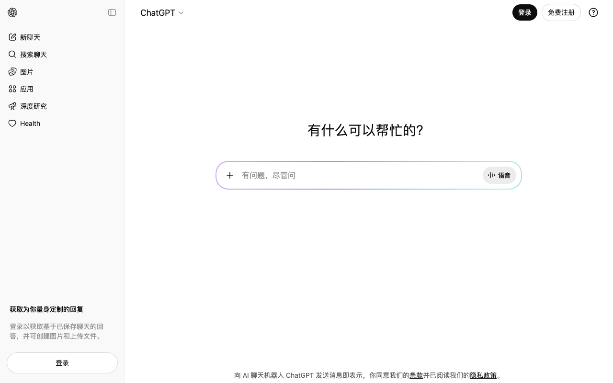
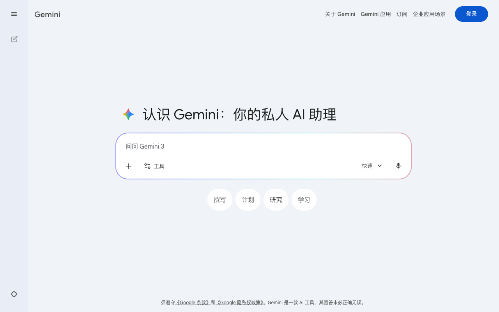
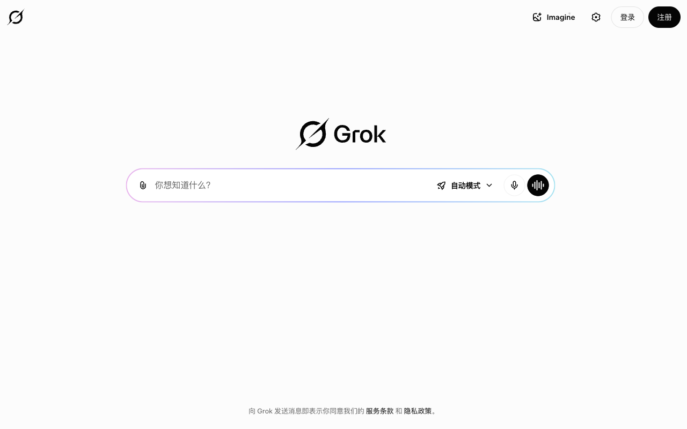

# 对话框动感光圈

> 为 ChatGPT、Gemini、Grok 输入框加上彩色流光描边的 Chrome 扩展。

[](LICENSE)
[](manifest.json)

## 效果预览

| ChatGPT | Gemini | Grok |
|---------|--------|------|
|  |  |  |

## 功能

- 输入框边框显示彩色渐变流光动画
- 支持亮色 / 暗色模式自动适配
- 完全不干扰原有布局：输入框高度自适应、附件按钮、页面滚动均正常
- 极简实现：仅 1 个 CSS 文件 + 1 个 JS 文件

## 支持站点

| 站点 | 地址 |
|------|------|
| ChatGPT | chatgpt.com |
| Gemini | gemini.google.com |
| Grok | grok.com |

## 安装方法

1. 下载本仓库（点击右上角 **Code → Download ZIP**，解压到任意文件夹）
2. 打开 Chrome，进入 `chrome://extensions`
3. 开启右上角 **开发者模式**
4. 点击 **加载已解压的扩展程序**，选择解压后的文件夹
5. 访问上述任意站点，输入框边框即会出现流光效果

## 技术说明

描边使用 `border: 2px solid transparent` + CSS 双层 `background`（`padding-box` 纯色填充 + `border-box` 彩虹渐变）实现，配合 `box-sizing: border-box` 防止布局偏移。整个插件不修改 `overflow`、`position` 等布局属性，不会破坏站点原有行为。

## 文件结构

```
├── manifest.json       # 扩展清单（Manifest V3）
├── styles/
│   └── glow.css        # 唯一 CSS：动画 + 描边 class + 站点内层清理
├── modules/
│   └── glow.js         # 唯一 JS：找到输入框容器 → 加 class
├── icons/              # 扩展图标
└── _locales/           # 国际化文案
```

## License

[MIT](LICENSE)
